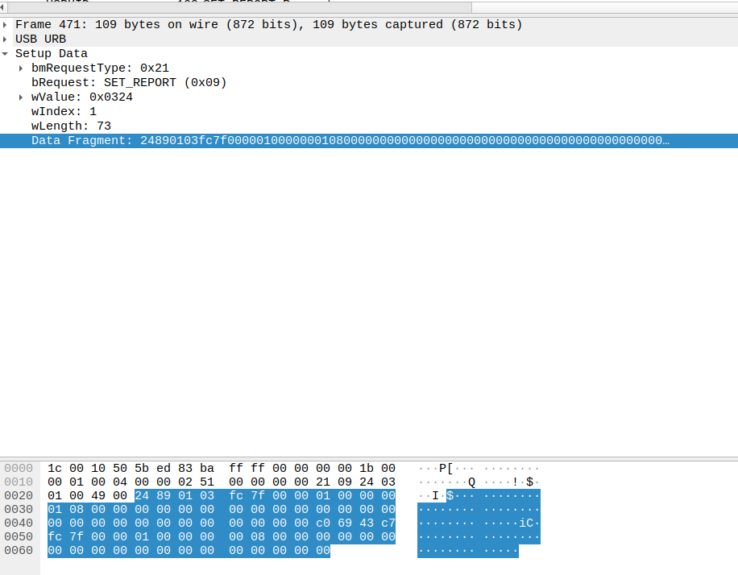

### Third component - the back button

The back button is fairly complicated and it seems like half the settings wouldnt work on linux anyway, so I'm only going to reverse engineer a partial component of this

So, lets start with the basics: we need to investigate how the mouse actually **reads** the value at the start to know what is the current value that has been stored on the mouse.

Quickly, I sniffed a few packets (large-button-back and the other duplicates), which tells me this

```
0000   1c 00 c0 62 d0 ee 83 ba ff ff 00 00 00 00 1b 00
0010   00 01 00 04 00 00 02 51 00 00 00 00 21 09 24 03
0020   01 00 49 00 24 88 05 04 09 00 01 04 d8 ef 20 ca
0030   a3 01 00 00 0a 00 00 00 00 00 00 00 03 00 00 00
0040   3c 00 00 00 d3 c8 12 18 6e 00 00 00 00 00 00 00
0050   00 00 00 00 00 00 00 00 00 00 00 00 00 00 00 00
0060   00 00 00 00 00 00 00 00 00 00 00 00 00
```

Since we know that `0x24` already going to be the start of our data packet, we can see that the packet would then be

`0x24` - write to mouse

`0x88` - header to tell the mouse that we want to update the back button

`0x05` - the length of the data

`0x04, 0x09, 0x00, 0x01, 0x04` - No idea what this is yet, but this is the data.

Sounds simple! 

Going by previous experience, I then fired up the previous payload which worked fine for getting the dpi values and the 

Request:
```
0x24 0x89 ... (where .. is all 0x00)
```

Received:
```
0x27 0x89 0x02 0x05 0x05 0x09 0x00 0x01 0x05 ... (where ... is the rest of the packet that is not relevant)
```

That doesnt seem right.

Looking at our previous settings, we know that the return packet will start the data from the fourth byte. From the third byte, we know that it will tell us how many bytes to expect holding the data.

Given that when we changed the setting on the mouse, we know that we wrote the following data to the mouse:

`0x04, 0x09, 0x00, 0x01, 0x04`

I would expect to see something like this in the received packet when I request the current status of this data.

Instead, what I see is this.

`0x05 0x09 0x00 0x01 0x05`

That doesn't seem quite right to me. There's some values there, but it's not quite what I was looking for.

I dumped a few more packets and played with the request and was not able to find a pattern as to what I was getting back from the mouse.

It seems to me like while we did use the reversed engineered read protocol, it might not actually be right.

Only one way to confirm that, right? more packet dumps!

I dropped the mouse from the virtual machine, fired up the usb packet sniffer, and reconnected the mouse. Once the mouse was loaded in, I killed the packet sniffer and started looking at the packet dump.

Here, we're looking specifically for packets that begin with 2489 (0x24 0x89) in the data segment, transmitted from the host to the mouse. (src = host, dst = 1.4.0)



Bingo.

This means that we're actually missing **some** data when we send a request for information the mouse, what data it is I'm not exactly sure yet. However, that's why we are not getting back the right data.

Time to snoop more packets!

Theres quite a few of those, so I'll just use one as an example

Setting to vertical toggle
```
... 24 88 05 04 09 00 02 03 ...
```

In all of the packets, `0x04` and `0x09` seem to be consistent **throughout** the packet as the start of the data.

In that case, in my read packet, since we've seen in the snooped packet from `generic` that the read request packet for `0x89` expects **one** value in the data stream, lets try `0x04`

Looking at the current state of the function, this means:

``` go
func (imp *IntelliMousePro) TriggerReadRequestPayload(read_property uint8) []byte {
	// byte is just an alias for uint8, which is what 0x00 is (or any numbers that do not exceed 8 bytes)
	request_arr := make([]byte, INTELLIMOUSE_PRO_SET_REPORT_LENGTH)
	for i := 0; i < INTELLIMOUSE_PRO_SET_REPORT_LENGTH; i += 1 {
		request_arr[i] = 0x00
	}
	request_arr[0] = INTELLIMOUSE_PRO_SET_REPORT
	request_arr[1] = read_property
	request_arr[2] = 0x00

	return request_arr
}
```

will now become 
``` go
func (imp *IntelliMousePro) TriggerReadRequestPayload(read_property uint8) []byte {
	// byte is just an alias for uint8, which is what 0x00 is (or any numbers that do not exceed 8 bytes)
	request_arr := make([]byte, INTELLIMOUSE_PRO_SET_REPORT_LENGTH)
	for i := 0; i < INTELLIMOUSE_PRO_SET_REPORT_LENGTH; i += 1 {
		request_arr[i] = 0x00
	}
	request_arr[0] = INTELLIMOUSE_PRO_SET_REPORT
	request_arr[1] = read_property
	request_arr[2] = 0x01
    request_arr[3] = 0x04

	return request_arr
}
```

We will think about how to make it better later, lets just hardcode it for now.

For each of the following experiments below, we will manually set it in the windows driver, drop the mouse from the vm, and then issue a read request to see if the values look more sane.

---
> Set to dpi toggle

Read Request Packet:
```
0x24 0x89 0x01 0x04 ...
```
Response:
```
0x27 0x89 0x00 0x05 0x04 0x09 0x00 0x02 0x01 ...
```

> Set to (back button)

Read Request Packet:
```
0x24 0x89 0x01 0x04 ...
```
Response:
```
0x27 0x89 0x00 0x05 0x04 0x09 0x00 0x01 0x04...
```

Set to vertical scrolling

Read Request Packet:
```
0x24 0x89 0x01 0x04 ...
```
Response:
```
0x27 0x89 0x00 0x05 0x04 0x09 0x00 0x02 0x03 
```

---

That looks much, much better.

Let us look at the packet of vertical scrolling that we captured just to confirm:

```
24 88 05 04 09 00 02 03 40 2d cf d0
0030   a3 01 00 00 60 2b cf d0 a3 01 00 00 00 00 8c 40
0040   81 be 69 40 02 13 e8 40 fc d3 d2 40 00 00 71 d4
0050   a3 01 00 00 81 be 69 40 cb d3 70 40 00 00 00 00
0060   00 00 00 00 07 00 00 00 00 00 00 00 00

```

So this confirms what I think should be the right protocol, as we can see `0x02 0x03` there, which appears to be the right value.