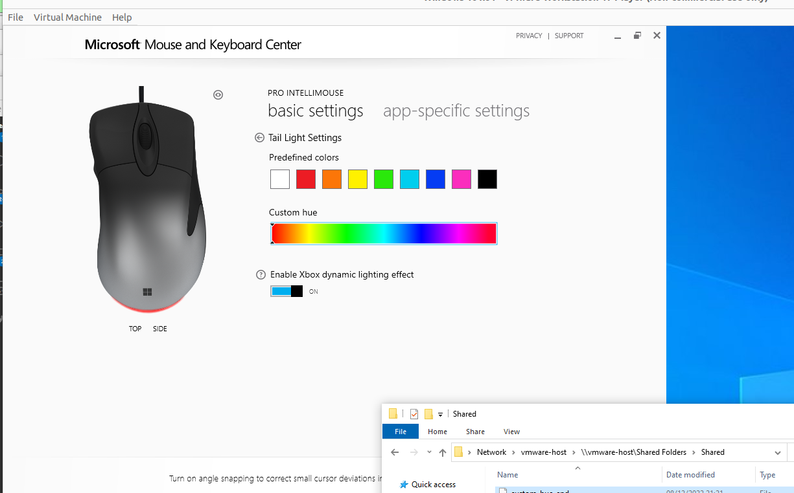
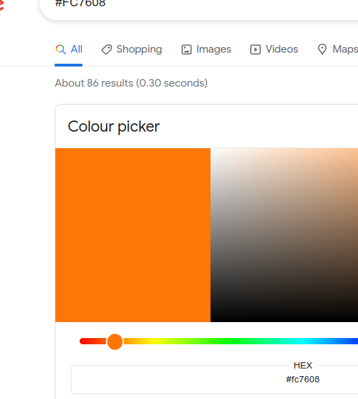

Thanks to kim visscher's excellent work, we know that 0xB2 is going to be the packet for the setting of a color

Let us investigate the custom-hue ones. For this, I dragged the slider right to the end

```
0000   1c 00 20 3a 8a cf 0f c9 ff ff 00 00 00 00 1b 00
0010   00 01 00 04 00 00 02 51 00 00 00 00 21 09 24 03
0020   01 00 49 00 24 b2 03 ff 00 00 01 01 01 01 01 01
0030   01 01 01 01 01 01 01 01 01 01 01 01 01 01 01 01
0040   01 01 01 01 01 01 01 01 01 01 01 01 01 01 01 01
0050   01 01 01 01 01 01 01 01 01 01 01 01 01 01 01 01
0060   01 01 01 01 01 01 01 01 01 01 01 01 01
```

And then the slider to the start
```
0000   1c 00 60 14 ef ce 0f c9 ff ff 00 00 00 00 1b 00
0010   00 01 00 04 00 00 02 51 00 00 00 00 21 09 24 03
0020   01 00 49 00 24 b2 03 ff 00 00 00 00 d8 30 bd 75
0030   09 02 00 00 30 00 00 00 30 00 00 00 30 00 00 00
0040   40 00 00 00 00 00 00 00 00 00 00 00 00 00 00 00
0050   00 00 00 00 00 00 00 00 00 80 40 40 00 00 00 00
0060   00 40 5f 40 01 00 00 00 00 00 00 00 00
```

The end packet certainly looks interesting. It's all populated with 01s.

24 b2 03 is definetly consistent, followed immediately by the ffs

Thing is, the start and end have the same colors, so Im not seeing any immediate color changes.

Lets have a look at the predefined colors

predefined-blue
```
 24 b2 03 05 3c f3 00 00 a0 ec b1 75
0030   09 02 00 00 90 dc fd 5a 09 02 00 00 01 01 00 00
0040   40 00 00 00 03 00 00 00 00 00 00 00 00 00 75 7b
0050   09 02 00 00 00 00 00 00 00 00 3c 40 00 00 00 00
0060   00 00 00 00 07 00 00 00 00 00 00 00 00
```

predefined-green

```
 24 b2 03 2a e8 0b 00 00 60 e4 b1 75
0030   09 02 00 00 40 d4 b1 75 09 02 00 00 01 01 44 00
0040   65 00 76 00 69 00 63 00 65 00 43 00 6f 00 6e 00
0050   74 00 72 00 6f 00 6c 00 44 00 61 00 74 00 61 00
0060   45 00 76 00 65 00 6e 00 74 00 35 00 30
```

predefined-orange
```
 24 b2 03 fc 76 08 00 00 00 33 96 75
0030   09 02 00 00 60 e4 b1 75 09 02 00 00 01 01 44 00
0040   65 00 76 00 69 00 63 00 65 00 43 00 6f 00 6e 00
0050   74 00 72 00 6f 00 6c 00 44 00 61 00 74 00 61 00
0060   45 00 76 00 65 00 6e 00 74 00 35 00 30
```

We know from our experience writing dpi packets that the packet structure usually is the first 3 being consistent, with the following data immediately being the payload.

We also know, that color codes come in either hex, RGB, CMYK, HSV, or HSL.

It would be nice if they gave us a native hex one, but Im guessing its either hex or RGB here...

Let us look again at microsoft mouse and center



Does anything stand out yet?

Our start and end packets are extremely consistent for the first few values, being

`24 b2 03 ff 00 00`

`24 b2 03 ff 00 00`

If you've done any sort of frontend programming, you will immediately recognise this color code `#FF0000`, which is red.

That is also the start and end of the slider.

Let us now look at the other predefined color packets that we captured.

predefined-orange shows as

`24 b2 03 fc 76 08`

and a quick google search shows us



Quickly checking against the others, it seems like this holds true for all of them. I've attached the packet dumps in this repository in case you want to see them for yourself, the relevant packets are right at the bottom.

We can clearly see that this is big endian format, which deviates from the previous DPI little endian format.
