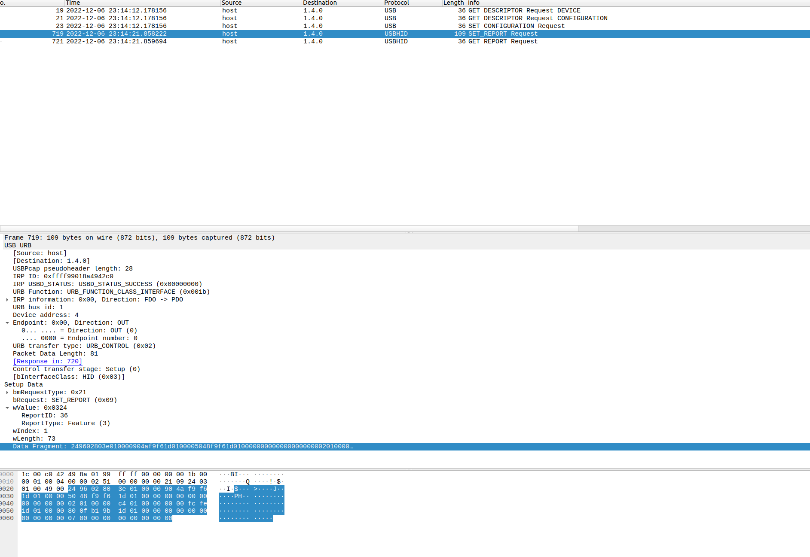
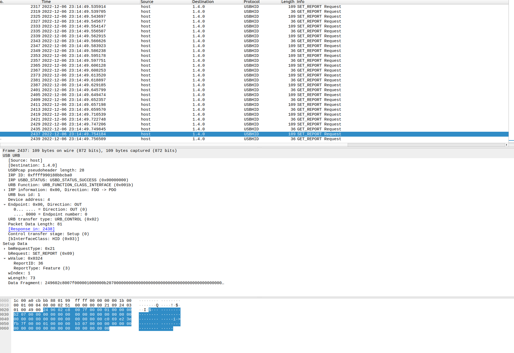

# DPI Settings

By grabbing a quick packet dump (Thanks mouse and keyboard center for having one of the most unintuitive things: Why the heck would you not allow the value to be entered manually?)

We can see the following values:

SET_REPORT is sent via USBHID to the mouse

The screen capture here shows us several other information





Notably, the Setup Data shows Report ID: 36 and WLength is 73.

In this case, it means that in hex the ReportID is 0x24 and the Length of the packet is 0x49 (base 8)

Looking at the packet, we can see that this is actually in little endian.
(https://www.section.io/engineering-education/what-is-little-endian-and-big-endian/)

DPI set to max, 16000
```
...     24 96 02 80 3e 01 00 00 90 4a f9 f6
0030   1d 01 00 00 50 48 f9 f6 1d 01 00 00 00 00 00 00
0040   00 00 00 00 02 01 00 00 c4 01 00 00 00 00 fc fe
0050   1d 01 00 00 80 0f b1 9b 1d 01 00 00 00 00 00 00
0060   00 00 00 00 07 00 00 00 00 00 00 00 00
```


Looking at the packet you can see 24 96 02 are consistent. It is immediatelly followed by 0x80 0x3e, which is 16,000 in little endian

Lets look at DPI set to min. That dpi packet is really messy because of the slider... which basically updates periodically.

```
        ... 24 96 02 c8 00 7f 00 00 01 00 00 00
0030   b2 07 00 00 00 00 00 00 00 00 00 00 00 00 00 00
0040   00 00 00 00 00 00 00 00 00 00 00 00 c0 69 e2 3e
0050   fb 7f 00 00 01 00 00 00 b3 07 00 00 00 00 00 00
0060   00 00 00 00 00 00 00 00 00 00 00 00 00

```

Once again we see 24 96 02, followed by c8 00, which tells me that that is definetly the dpi value in this packet (200 is the minimum for the intellimouse)

following that is 7f, which differs from 01 above. that's 127 which tells me nothing..

I have no idea what the rest means.


Lets look at some of the other values on the sliders on the way down
(Random selection)
```
0000   1c 00 a0 cb bb 88 01 99 ff ff 00 00 00 00 1b 00
0010   00 01 00 04 00 00 02 51 00 00 00 00 21 09 24 03
0020   01 00 49 00 **24 96 02 5e 01 7f 00 00 01 00 00 00
0030   83 00 00 00 00 00 00 00 00 00 00 00 00 00 00 00
0040   00 00 00 00 00 00 00 00 00 00 00 00 c0 69 e2 3e
0050   fb 7f 00 00 01 00 00 00 84 00 00 00 00 00 00 00
0060   00 00 00 00 00 00 00 00 00 00 00 00 00**

```
We can see here its dpi of 350 being set on the way down

```
0000   1c 00 50 00 72 88 01 99 ff ff 00 00 00 00 1b 00
0010   00 01 00 04 00 00 02 51 00 00 00 00 21 09 24 03
0020   01 00 49 00 **24 96 02 72 06 00 00 00 00 00 4f 00
0030   55 00 53 00 45 00 00 00 0c 00 00 00 00 00 00 00
0040   00 00 00 00 07 00 00 00 00 00 00 00 02 00 00 00
0050   01 00 00 00 00 00 26 ff 1d 01 00 00 45 00 00 00
0060   0c 00 00 00 00 00 00 00 00 00 00 00 07**
```

We can see here its DPI of 1650 being set on the way down

The rest of the values really make no sense to me.

Right now, I'm dumping a second max pcap and seeing if the values are consistent

dpi-max-2
```
        ... 24 96 02 80 3e 01 00 00 b0 62 ce fe
0030   1d 01 00 00 90 58 ce fe 1d 01 00 00 01 00 00 00
0040   01 00 00 00 03 00 00 00 ff ff ff ff 00 00 26 ff
0050   1d 01 00 00 40 42 d4 5d fb 7f 00 00 00 00 00 00
0060   00 00 00 00 07 00 00 00 00 00 00 00 00
```

dpi-min-2
```
        ... 24 96 02 c8 00 01 00 00 90 5e ce fe
0030   1d 01 00 00 b0 62 ce fe 1d 01 00 00 01 01 44 00
0040   65 00 76 00 69 00 63 00 65 00 43 00 6f 00 6e 00
0050   74 00 72 00 6f 00 6c 00 44 00 61 00 74 00 61 00
0060   45 00 76 00 65 00 6e 00 74 00 35 00 30
````

If you compare these values to the ones above, you can see clearly that the only thing remaining consistent is 

For dpi max, `24 96 02 80 3e`
For dpi min, `24 96 02 c8 00` 

Even though 01 remains consistent for dpi-max dpi-min immediately makes that not valid.

I'll dump a few more captures and see if there's a pattern.